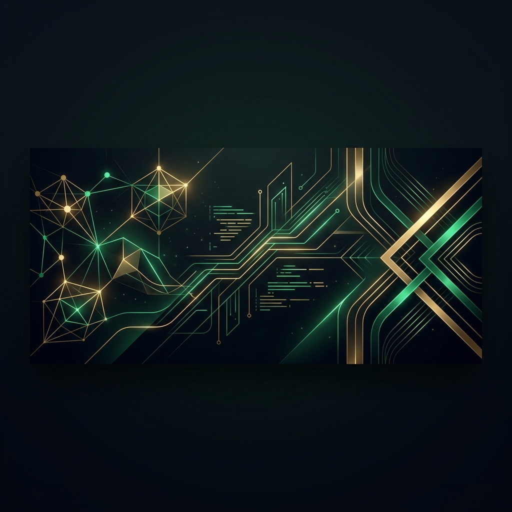

  

  <h1>Muhammad Bilal</h1>
  
  

    
    
    
    
  

  

   

  

    <b>25+ Shipped Projects</b> · <b>100% Upwork Job Success</b> · <b>Global Clients</b> · <b>Top Rated Developer</b>
  

  

## 🚀 Professional Services

I partner with startups and founders to build production-grade software from design to launch in **4 to 8 weeks**.

<table width="100%">
  <thead>
    <tr>
      <th width="30%">Platform / Service</th>
      <th width="50%">Architecture & Technologies</th>
      <th width="20%">Est. Delivery</th>
    </tr>
  </thead>
  <tbody>
    <tr>
      <td><b>📱 Flutter Mobile Apps</b></td>
      <td>Clean Architecture, Riverpod, GoRouter, Hive/Isar, Firebase, Supabase</td>
      <td>4–8 weeks</td>
    </tr>
    <tr>
      <td><b>🌐 Next.js Web Apps</b></td>
      <td>Next.js 15, App Router, TypeScript, React Server Components, Tailwind</td>
      <td>3–6 weeks</td>
    </tr>
    <tr>
      <td><b>🤖 AI Integrations</b></td>
      <td>OpenAI (GPT-4o), Claude 3.5, Gemini Pro, Vector Databases, LangChain</td>
      <td>1–3 weeks</td>
    </tr>
    <tr>
      <td><b>⚡ Full-Stack SaaS Products</b></td>
      <td>Authentication, Multi-tenancy, Stripe Subscriptions, Webhooks, Postgre/MySQL</td>
      <td>6–10 weeks</td>
    </tr>
  </tbody>
</table>

---

## 🛠️ Expertise & Tech Stack

<table width="100%">
  <tr>
    <td width="50%" valign="top">
      <h4>📱 Mobile Development</h4>
      
      
      
       
      
      
      
    </td>
    <td width="50%" valign="top">
      <h4>🌐 Web & Fullstack</h4>
      
      
      
       
      
      
    </td>
  </tr>
  <tr>
    <td width="50%" valign="top">
      <h4>💾 Database & Cloud Services</h4>
      
      
       
      
      
    </td>
    <td width="50%" valign="top">
      <h4>🧠 AI & Integration Services</h4>
      
      
       
      
      
    </td>
  </tr>
</table>

---

## ⚡ Active In 2026 (Currently Building)

These are my active builds for this year. Real products solving real problems:

- 🏥 **VivaSiHealth** — Premium mobile app for biohacking & longevity (built using Flutter, Riverpod, and local database storage).
- 🏠 **StageSnap** — AI-powered virtual staging platform for real estate agents and photographers (Next.js, Supabase, and custom AI image generation models).
- 📝 **IELTS Evaluator** — AI-driven IELTS writing assessment platform for teachers and students (Next.js, Tailwind, and OpenAI APIs).

---

## 📊 Live GitHub Activity (Auto-Updates)

  
  

    

  

---

  <h3>🤝 Let's Launch Your Idea</h3>
  
I am active and currently accepting new contracts for 2026. Let's build your mobile app or SaaS.

  
  

    
    
  

